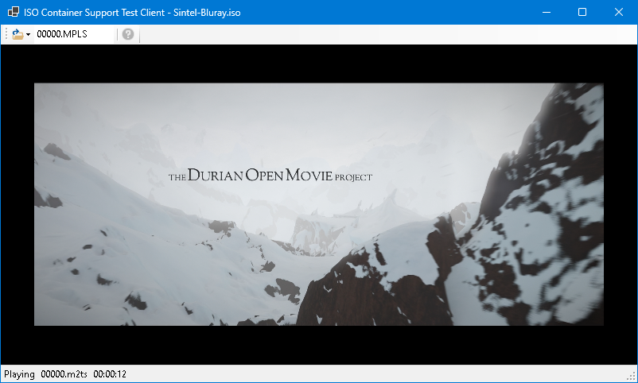

# IsoContainerPlayback plugin for Emby
The **IsoContainerPlayback** plugin will hopefully allow for **Emby** to play videos that are stored inside ISO images of BluRay, DVD, and VideoCD discs.

**Note:** At this time this plugin is incomplete, and cannot operate without potential support within **Emby** server.

## Projects
The solution consists of the following proejcts:

- **IsoContainerPlayback**
- **IsoContainerPlayback.TestClient**
- **IsoContainerPlayback.Tests**

### IsoContainerPlayback
This is the **Emby** plugin itself. It consists of the plugin code (to interface with **Emby** server), and a class called `IsoStream` (and the derived classes `BluRayIsoStream`, `DvdIsoStream`, and `VideoCdIsoStream`), which provide the core functionality of streaming a video from the contents of an ISO.

`IsoStream` (and it's derivatives) handle the task of opening the files from within the specified ISO and presenting them as a single .Net `Stream`. The goal is for this stream to be used to allow for the playback of video from within an ISO.

**Note:** Whilst `IsoStream` is complete and working, the actual **Emby** plugin code is still work-in-progress. The plugin will correctly register itself with **Emby** server, and there are initial attempts at exposing API endpoints, but these still need more work to make them useful.

This project also includes the source to any required 3rd-party libraries, as plugins can only access framework libraries and the **Emby** SDK.

### IsoPlayback.TestClient
This is a WinForms project that uses an embedded **VLC** player to try and prove and test the `IsoStream` implementations within the **IsoContainerPlayback** project.

The app will load a specified ISO using `IsoStream`, and then pass the stream to the embedded **VLC** player to play using the following code:

```
IsoStream isoStream;

// Load an iso into isoStream

videoView.MediaPlayer.Play(new Media(_libVlc, new StreamMediaInput(isoStream)));
```

If the video is found on the ISO it should begin to play, as shown below:



This demonstrates that `IsoStream` could possibly be usable to play a video from within an ISO.

### IsoContainPlayback.Tests
A series of tests to try and validate that the `IsoStream` implementations function correctly.

## Acknowldgements
This project is made possible through the use of the following open source projects.

### DiscUtils
[Project Homepage](https://github.com/DiscUtils/DiscUtils)

**DiscUtils** is a .NET library to read and write ISO files and Virtual Machine disk files (VHD, VDI, XVA, VMDK, etc). **DiscUtils** is developed in C# with no native code (or P/Invoke).

### BDInfo
[Project Homepage](https://github.com/UniqProject/BDInfo)

The **BDInfo** tool was designed to collect video and audio technical specifications from Blu-ray movie discs, including:
- Disc Size
- Playlist File Contents
- Stream Codec and Bitrate Details
